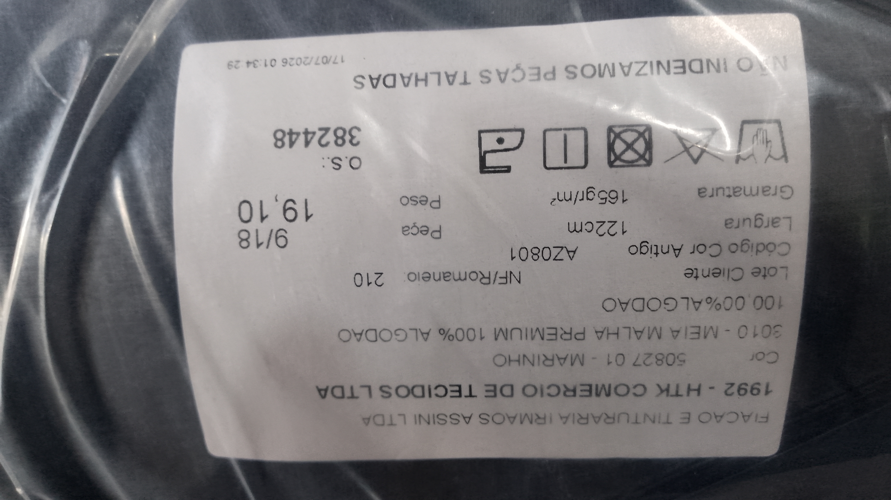
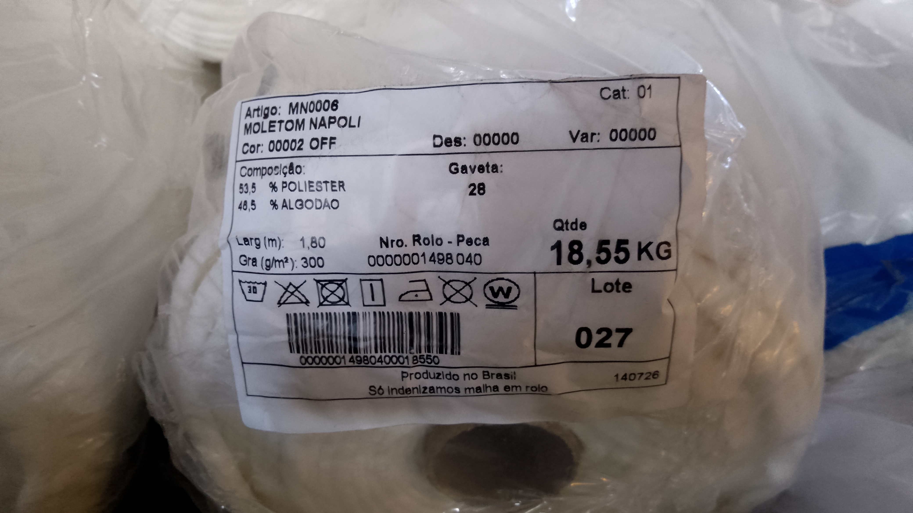
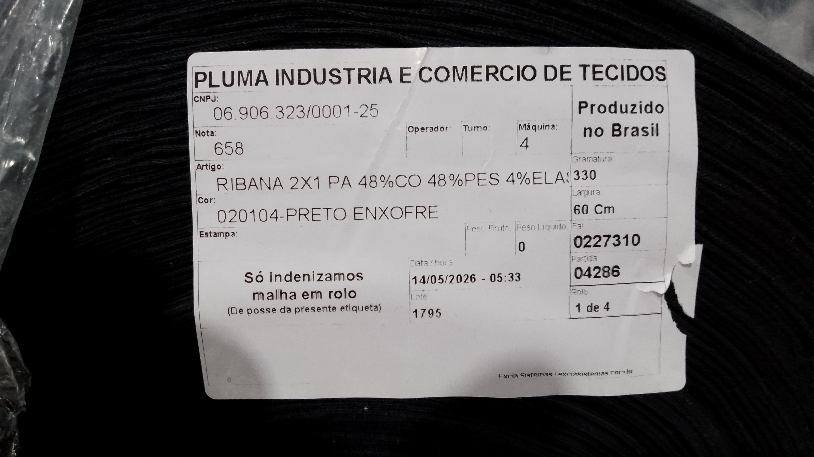
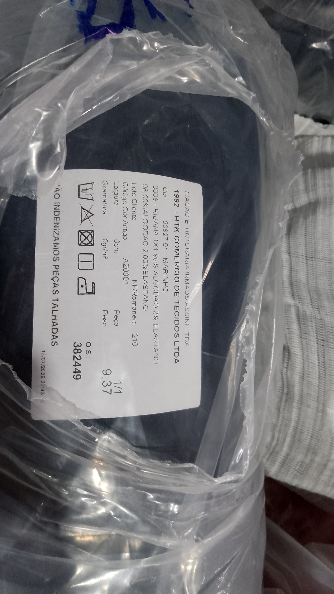

# Gramatura dos tecidos — de onde vem cada número

O kg de todo enfesto sai desta conta, e o último fator é o que está aqui:

```
kg = comprimento (m) × largura (m) × camadas × gramatura (g/m²) ÷ 1000
```

A **largura** é a que está cadastrada na fase da grade. Nos panos **tubulares**
essa largura é a do tubo achatado, e ali há **duas camadas de pano** — por isso
a gramatura cadastrada no programa é o **dobro** da que vem na etiqueta. Nos
panos **abertos** (ramados) a etiqueta entra direto.

> **O erro a não repetir:** cadastrar o número da etiqueta num pano tubular.
> Aconteceu em 27/08/2026 com a malha (165 em vez de 330): o consumo saiu pela
> metade, e a conferência pelo peso da bobina caiu de ~16 kg para 8 kg.

---

## O que está cadastrado hoje (27/08/2026)

| tecido | g/m² no programa | forma | vem de |
|---|---|---|---|
| Malha Algodão | **330** | tubular 1,22 m | etiqueta HTK: 165 × 2 |
| Moletom | **300** | aberto 1,80 m | etiqueta Napoli, direto |
| Ribana Moletom | **660** | tubular 0,60 m | etiqueta Pluma: 330 × 2 |
| Ribana Malha Algodão | **530** | tubular 0,53–0,56 m | ⚠️ **estimado** — ver abaixo |
| Texturizado Rugão | **270** | aberto 1,57 m | informado pela produção |
| Texturizado Prime | **250** | aberto 1,52 m | informado pela produção |
| Texturizado Jaguar | **250** | aberto | igual ao Prime |
| Piquet | 220 | aberto 1,75 m | catálogo — uso quase nulo |
| Tactel | 160 | — | catálogo — sem uso em OS |
| Ribana Gola Polo · Piquet Dry | — | — | nunca apareceram em OS |

---

## As etiquetas

### Meia Malha Premium 100% algodão — HTK / Fiação e Tinturaria Irmãos Assini


```
3010 - MEIA MALHA PREMIUM 100% ALGODAO
Gramatura ....... 165 gr/m²
Largura ......... 122 cm       (tubular)
Peso da peça .... 19,10 kg
```

**Cadastrado: 330** (165 × 2 faces do tubo).

A metragem do rolo confirma a dobra: com 330 g por metro de tubo, os 19,10 kg
dão **47 metros** — rolo normal de malha. Sem dobrar dariam 95 m, que não
existe.

---

### Moletom Napoli MN0006 — 53,5% poliéster / 46,5% algodão


```
Artigo MN0006 - MOLETOM NAPOLI
Gra (g/m²) ...... 300
Larg (m) ........ 1,80          (aberto / ramado)
Qtde ............ 18,55 KG
```

**Cadastrado: 300**, direto — pano aberto não dobra. Os 18,55 kg dão 34 m.

---

### Ribana 2x1 PA — Pluma Indústria e Comércio de Tecidos


```
RIBANA 2X1 PA  48%CO  48%PES  4%ELASTANO
Gramatura ....... 330
Largura ......... 60 Cm         (tubular)
NF 658 · Lote 1795 · Rolo 1 de 4
```

**Cadastrado: 660** (330 × 2). É a ribana do punho e da barra do moletom.

---

### Ribana 1x1 — HTK (a que ficou estimada)


```
3009 - RIBANA 1X1  98% ALGODAO  2% ELASTANO
Gramatura ....... 0 gr/m²       <-- em branco na etiqueta
Largura ......... 0 cm          <-- em branco na etiqueta
Peso ............ 9,37 kg
```

**Este fornecedor imprime a etiqueta com gramatura e largura zeradas.** Não é
falta de procurar: o dado não vem.

O que se sabe: o rolo pesa **9,37 kg** e o tubo mede **53–56 cm** (medido com
fita na fábrica). O valor cadastrado, **530**, vem do catálogo de ribana 1x1 com
elastano (~265 g/m² × 2) e é o que dá um rolo de comprimento plausível:

| gramatura da etiqueta | no programa | comprimento do rolo de 9,37 kg |
|---|---|---|
| 220 | 440 | 39,1 m |
| 250 | 500 | 34,4 m |
| **265** | **530** ← cadastrado | **32,4 m** |
| 380 | 760 | 22,6 m |
| 490 | 980 | 17,5 m |

**Como fechar quando puder:** medir os metros de um rolo, ou conseguir a ficha
técnica do HTK. Aí é trocar um número — e este arquivo.

---

## Como conferir um valor cadastrado

O programa calcula, na folha de OS, quanto pesaria **uma bobina** com a
gramatura cadastrada (`pesoPorBobinaFase`). Um rolo real da casa pesa de 15 a
20 kg:

| tecido | kg por bobina hoje |
|---|---|
| Malha Algodão | 15,8 |
| Moletom | 14,4 |
| Ribana Moletom | 14,1 |
| Ribana Malha Algodão | 4,1 |

**A ribana não passa nesse teste, e não é erro de gramatura:** as grades
cadastram "1 bobina" na fase da gola, mas a gola gasta só uma fração do rolo. O
teste vale para o tecido principal.

---

## Sem etiqueta, dois números resolvem

```
gramatura = kg do rolo × 1000 ÷ (metros × largura × 2 se tubular)
```

Peso do rolo e metragem, com a largura do tubo. Dispensa catálogo: é o pano da
casa.
